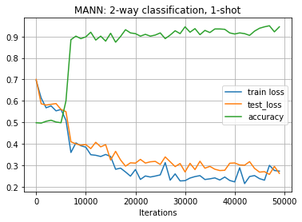
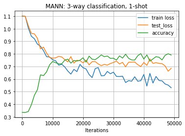
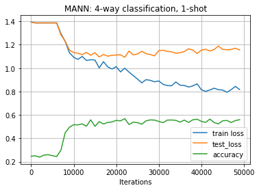
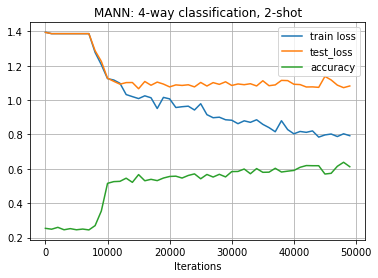
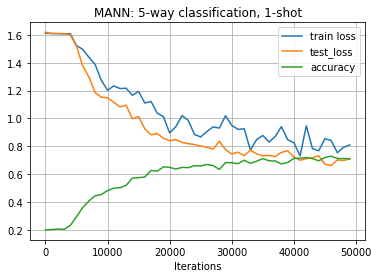

# Homework 1: Meta Learning with MANN

## Contents:

- [Original assignment](http://cs330.stanford.edu/material/hw1_updated.zip) containing the Omniglot dataset
- `task_description.pdf` describes the tasks
- `homework_1_solution.ipynb` contains the task solution 

## Problem 1 and 2

Please refer to the solution file.

## Problem 3

The plots are consistent with my expectations. First of all, with the growing number of classes  (<em>N</em>-way classification), the complexity of the task increases and thus, it is more difficult to successfully classify the unseen examples from meta-testing set. However, if we increase the number of examples seen (<em>K</em>-shot) during the meta-training, the accuracy of the meta-testing classification, not suprisingly, increases. Finally, the train/test loss curves are consistent with what one should expect to see during training of a classifier.

## Problem 4

My personal goal with respect to this homework was primarily to implement **MANN** and understand the Black-Box Adaptation method. This is why I have decided to skip the trivial experimentation part. However, I liked the challenge of achieving above 60% accuracy on 5-way 1-shot learning. I have experimented with convolutional architectures (similar to ones used with MNIST classification), but somehow did not get any extraordinary results. What has helped the most is basically replacing vanilla LSTMs with bidirectional ones and making the network more beefy ("if it does not work - more layers...".